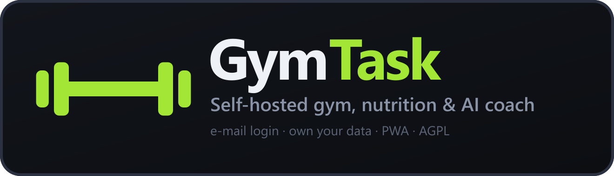
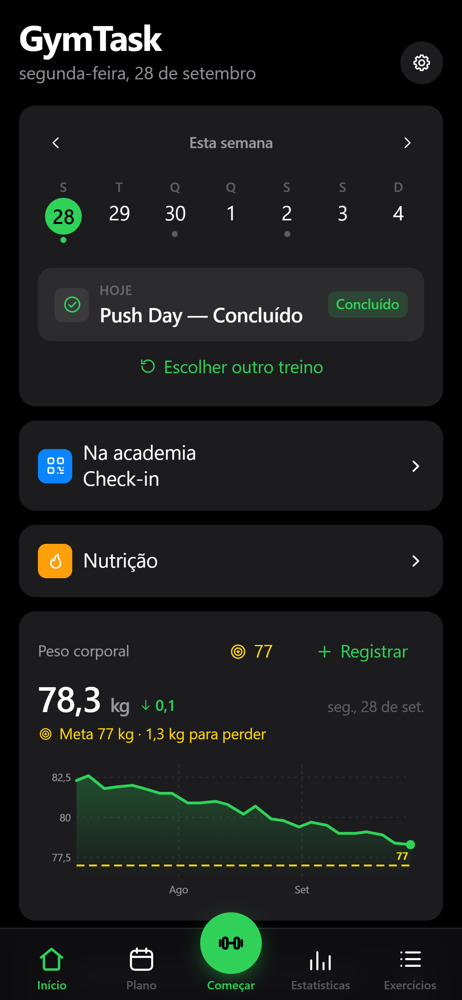
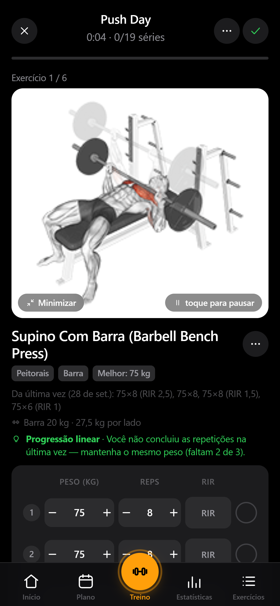
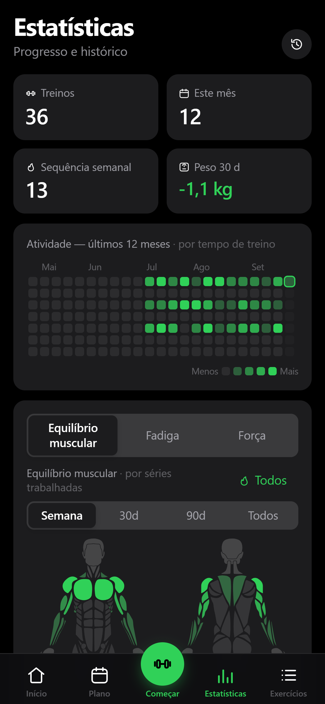

<div align="center">



<br>

**GymTask** — seu treino, sua dieta e seu coach com IA, num app que você controla.**

Planeje a semana, execute treinos guiados, registre cada série e seu peso corporal,
acompanhe calorias e macros, e peça ao coach com IA para montar ou revisar seu plano.
Tudo em português, instalável como app na tela inicial, com login por e-mail e senha
e dados sincronizados na nuvem.

<sub>GymTask é um derivado de openGym (https://github.com/DuarteSantos8/openGym), licença AGPL-3.0 mantida.</sub>

<br>

[](LICENSE)


</div>

<br>

<div align="center">
<table>
<tr>
<td align="center"><br><sub><b>Início</b> — treino de hoje e peso</sub></td>
<td align="center"><br><sub><b>Treino guiado</b> — demos animados e séries</sub></td>
<td align="center"><br><sub><b>Estatísticas</b> — mapa de calor, gráficos e PRs</sub></td>
</tr>
</table>
</div>

<div align="center">

### [📦 Código-fonte no GitHub](https://github.com/Paulo-Santos20/GymTask) · [🗺️ Roteiro](ROADMAP.md) · [🚀 Como publicar](docs/DEPLOY_VERCEL.md)

</div>

## Por quê

A maioria dos apps de treino prende seus dados no servidor de outra empresa, cobra
assinatura ou some quando a startup fecha. O GymTask é o oposto: **o frontend roda
na Vercel, os dados ficam no seu projeto Firebase, e o código é seu para forkar.**
E continua moderno: instalável como app, login por e-mail e senha, suporte offline,
sincronização entre celular e computador — além de um módulo de nutrição e um coach
com IA que o openGym original não tem.

## Funcionalidades

- 🏋️ **Treinos guiados** — o app sabe que dia é hoje e abre a sessão do dia; pergunta seu peso antes, preenche os pesos da última vez, cronômetro de descanso, detecção de PRs, peso por exercício
- 📈 **Progressão que segue uma regra** — linear, **Greyskull LP**, dupla progressão com faixa de repetições visível, ou por tempo; pesos já certos ao abrir a sessão, cada meta dizendo *por que* é aquele número
- 💪 **1RM estimado** — por exercício, a partir da sua melhor série válida, com curva de evolução e calculadora
- 🗓️ **Plano semanal** — uma rotina por dia da semana, sobre uma biblioteca de **1.324 exercícios** (com busca, demos animados e mapa muscular)
- 🔗 **Supersets, aquecimento, deload planejado, exercícios por tempo, cardio** — tudo contado do jeito certo nas estatísticas
- 🥗 **Nutrição** — meta calórica e macros (TDEE por Mifflin-St Jeor), banco de ~200 alimentos BR com busca sem acento, busca externa (USDA / Open Food Facts / Nutritionix via proxy), diário por refeição com desfazer
- 🧠 **Coach com IA (Grok, Groq)** — responde por chat, monta a semana de treinos e propõe ajustes a partir do que você registrou; cada mudança mostra a evidência e só entra com sua aprovação (com desfazer)
- 📥 **Traga seu histórico** — importação de **FitNotes** (Android e iOS), **Strong**, **Hevy** (CSV ou direto com chave Hevy Pro) e peso corporal de export do **Apple Health**
- 📱 **PWA instalável** — adicione à tela inicial no Android ou no iPhone; funciona offline, com login por e-mail e senha e sincronização quando o Firebase está configurado
- 🟩 **Estatísticas** — mapa de calor de atividade, mapa muscular (volume, fadiga, força), gráficos e PRs
- 🔔 **Lembretes** — notificação diária de treino via Firebase (tópico `gytask-daily`) e alertas de descanso
- 📦 **Seus dados, seus mesmo** — exportação/importação JSON com um toque, modo visitante, **sem telemetria**; troca kg ↔ lb com conversão dos valores
- 🤖 **MCP server** (opcional) — permite a um cliente como Claude Desktop ou Cursor ler seu histórico em suas palavras. Somente leitura, local, nada sai da sua máquina. Veja [mcp/README.md](mcp/README.md)

## Começo rápido (deploy: Vercel + Firebase)

O caminho oficial de publicação é **frontend estático na Vercel + Auth/Firestore/Functions no Firebase**. O guia completo está em **[docs/DEPLOY_VERCEL.md](docs/DEPLOY_VERCEL.md)**; o resumo:

1. Crie um projeto no [Firebase Console](https://console.firebase.google.com/): ative **Authentication → E-mail/senha**, crie um app Web e anote as 6 chaves `VITE_FIREBASE_*`.
2. Importe o repositório na [Vercel](https://vercel.com/new) e defina **Root Directory = `frontend/`** (Settings → General) — sem isso a Vercel tenta publicar o backend local `api/` como Serverless Functions e o plano Hobby estoura o limite de 12. As variáveis `VITE_FIREBASE_*` + `VITE_NUTRITION_PROXY_URL` vão em **Settings → Environment Variables**.
3. Adicione o domínio da Vercel em **Authentication → Authorized domains** no Firebase.
4. (Opcional, para Coach e busca de alimentos) `firebase deploy --only functions` com `XAI_API_KEY` e as chaves Nutritionix — ver `functions/.env.example`.

> Credenciais Firebase deste fork configuradas (projeto `gymtask-ce4b6`) e o frontend já
> publicado em produção (`gymtask-jtu8.vercel.app`); faltam as chaves xAI/Nutritionix para o
> Coach via function, o deploy das functions e o domínio da Vercel em Authorized domains.

## Desenvolvimento local

Sem Firebase configurado, tudo funciona localmente (localStorage + API local de fallback):

```bash
cd frontend && npm install && npm run dev
```

```bash
cd frontend && npm test    # lógica de treino e nutrição (vitest)
```

> **Sobre a mídia dos exercícios:** ela chega ao GymTask via
> [hasaneyldrm/exercises-dataset](https://github.com/hasaneyldrm/exercises-dataset), que
> redistribui o [ExerciseDB v1](https://exercisedb.dev/) — os metadados e textos de instrução são
> MIT, mas as imagens e animações são conteúdo de terceiros coberto *nem* por essa licença MIT
> *nem* pela AGPL do GymTask, e a titularidade está atualmente disputada entre a Gym visual e a ExerciseDB.
> O GymTask não redistribui essa mídia: sua instância baixa do upstream. Reutilizá-la você mesmo,
> comercialmente ou não, exige acertar com o detentor dos direitos — ver [NOTICE.md](NOTICE.md).

## Como funciona

```
┌─────────────┐        ┌──────────────────────────────┐
│  Seu celular│──HTTPS─▶│  Vercel (frontend estático)  │
│  / computador        └──────────────────────────────┘
│         │ login e dados (SDK Firebase, direto no browser)
│         ▼
│  ┌──────────────────────────────┐   ┌───────────────────────────┐
│  │  Firebase (Auth + Firestore │   │  Cloud Functions: coach,  │
│  │  doc users/{uid}/state/app) │   │  nutritionProxy,          │
│  └──────────────────────────────┘   │  pushDailyReminder        │
└─────────────────────────────────────┘───────────────────────────┘
```

- **frontend/** — React 19 + Vite (React Router via HashRouter, Zustand), build estático publicado na Vercel
- **Autenticação** — Firebase Auth e-mail/senha (`frontend/src/lib/firebase.js`, `views/Login.jsx`); sem `VITE_FIREBASE_*` configurado, o app roda em modo local/visitante
- **Dados** — Firestore (`users/{uid}/state/app`) quando configurado; senão, `localStorage` + HTTP `/api/data` de fallback
- **api/** — backend Node sem framework herdado do upstream, usado no dev local e como fallback; o Coach roda também via Cloud Functions em **functions/** (`coach`, `nutritionProxy`, `pushDailyReminder`)
- A API HTTP de fallback está documentada em [`api/openapi.yaml`](api/openapi.yaml).

## Seus dados

Com Firebase configurado, ficam no **Firestore do seu projeto** (`users/{uid}/state/app`), com cache offline no aparelho. Sem Firebase, ficam no `localStorage` do navegador (`gym_state_v1`, nutrição em `gym_nutrition_v1`) e, no dev local com a API, em JSON no disco. **Exporte seu JSON em Configurações e você tem backup de tudo.** O app não tem telemetria.

## Configuração

Tudo via variáveis de ambiente (ver `frontend/.env.example` e `functions/.env.example`):

| Variável | O que é |
|---|---|
| `VITE_FIREBASE_API_KEY` / `VITE_FIREBASE_AUTH_DOMAIN` / `VITE_FIREBASE_PROJECT_ID` / `VITE_FIREBASE_STORAGE_BUCKET` / `VITE_FIREBASE_MESSAGING_SENDER_ID` / `VITE_FIREBASE_APP_ID` | Credenciais do app Web Firebase (login + Firestore) |
| `VITE_NUTRITION_PROXY_URL` | URL da function `nutritionProxy` (busca de alimentos Nutritionix sem expor a chave) |
| `XAI_API_KEY` (+ `XAI_MODEL`, padrão `grok-3-mini`) | Chave xAI para o Coach (só no servidor/functions, nunca no bundle) |
| `NUTRITIONIX_APP_ID` / `NUTRITIONIX_APP_KEY` | Chaves Nutritionix para o proxy (só no servidor/functions) |
| `VITE_IMG_BASE` / `VITE_GIF_BASE` | Base da CDN das mídias dos exercícios (jsDelivr, dataset `@7455efae`) - embutida no build do frontend (produção Vercel) |

A especificação do projeto (arquitetura, contrato Firebase, Coach, nutrição) vive em [GYMTASK.md](GYMTASK.md).

## Roteiro

O plano vive em [ROADMAP.md](ROADMAP.md): fechar o rebrand restante, credenciais e deploy, e as ideias futuras (nutrição extra, streaming do coach, sync em tempo real).

## Tecnologia

React 19 + Vite (React Router, Zustand) · Firebase (Auth, Firestore, Cloud Functions) · Vercel ·
dados de exercícios de [hasaneyldrm/exercises-dataset](https://github.com/hasaneyldrm/exercises-dataset)
(metadados e instruções MIT; mídia © Gym visual — ver [Licença](#licença)).

A lógica de treino — regras de progressão, estimativa de 1RM, leitura de sessão registrada — e
a de nutrição (TDEE, banco de alimentos) vivem em funções puras sob `frontend/src/lib/` com
testes ao lado: `npm test` em `frontend/`.

## Contribuindo

Issues e PRs são bem-vindos no [repositório do fork](https://github.com/Paulo-Santos20/GymTask) — ver [CONTRIBUTING.md](CONTRIBUTING.md).

## Licença

**GymTask's own code** is [GNU AGPL v3.0](LICENSE) — free and open source. You can self-host,
use, modify and share it; if you run a modified version as a network service, you must offer that
version's source under the same license. Nobody can turn GymTask into a closed, proprietary
product.

**Third-party content is not, and GymTask cannot sublicense it.** The exercise metadata and
instruction text originate from [ExerciseDB v1](https://exercisedb.dev/) and reach GymTask through
[hasaneyldrm/exercises-dataset](https://github.com/hasaneyldrm/exercises-dataset) under the
**MIT** license. The exercise images and animations are third-party content covered by neither
that license nor the AGPL, and their ownership is **currently unresolved** — the upstream dataset
attributes them to [Gym visual](https://gymvisual.com/) under a non-transferable permission, while
[ExerciseDB/AscendAPI](https://exercisedb.io/faq) claims to be their creator and owner. A
clarification has been requested. GymTask does not redistribute them (your instance fetches them
at first run) and does not relicense them. To reuse that media yourself, clear it with the rights
holder first.

Full third-party notices, including the body-diagram geometry: **[NOTICE.md](NOTICE.md)**.
